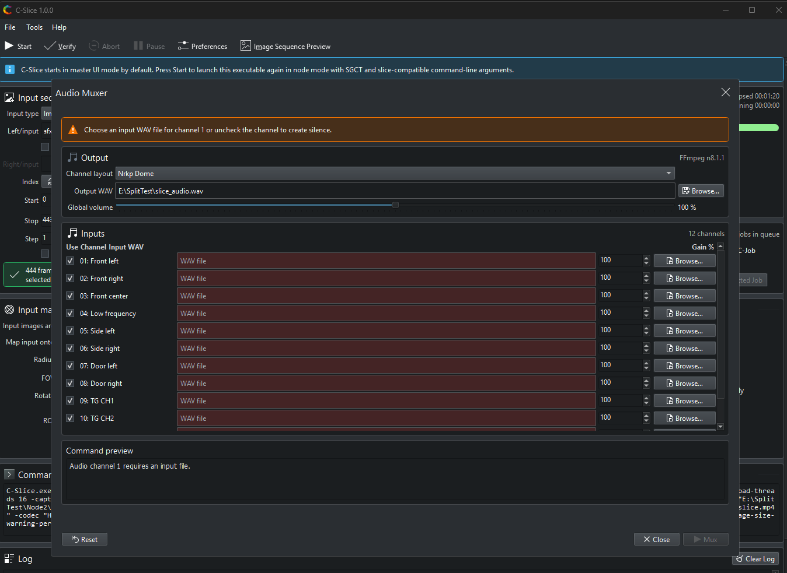

# Audio Muxer

The **Tools > Audio Muxer** dialog combines mono channel files into one multi-channel WAV file. It is useful when a production exports one WAV file per speaker channel and the playback system expects a single interleaved file.



## Basic workflow

1. Open **Tools > Audio Muxer**.
1. Choose a channel layout.
1. Choose an output WAV file.
1. Assign input WAV files to the active channels.
1. Uncheck channels that should be filled with silence.
1. Adjust global volume or per-channel gain if needed.
1. Start muxing.

Unchecked channels are filled with silence in the FFmpeg filter graph. Global volume and per-channel gain are multiplied before muxing.

## Channel layouts

Layouts are read from `data/audio-channel-layouts.json`. If the file cannot be read, C-Slice falls back to built-in Stereo, 5.1, 7.1, 9.1, and Nrkp Dome layouts.

The layout file has this shape:

```json
{
  "layouts": [
    {
      "name": "Nrkp Dome",
      "channels": [
        "01: Front left",
        "02: Front right",
        "03: Front center"
      ]
    }
  ]
}
```

Edit the layout names and channel labels to match the venue or production convention.

## FFmpeg requirement

The Audio Muxer needs `ffmpeg.exe` next to C-Slice or available on the system `PATH`.