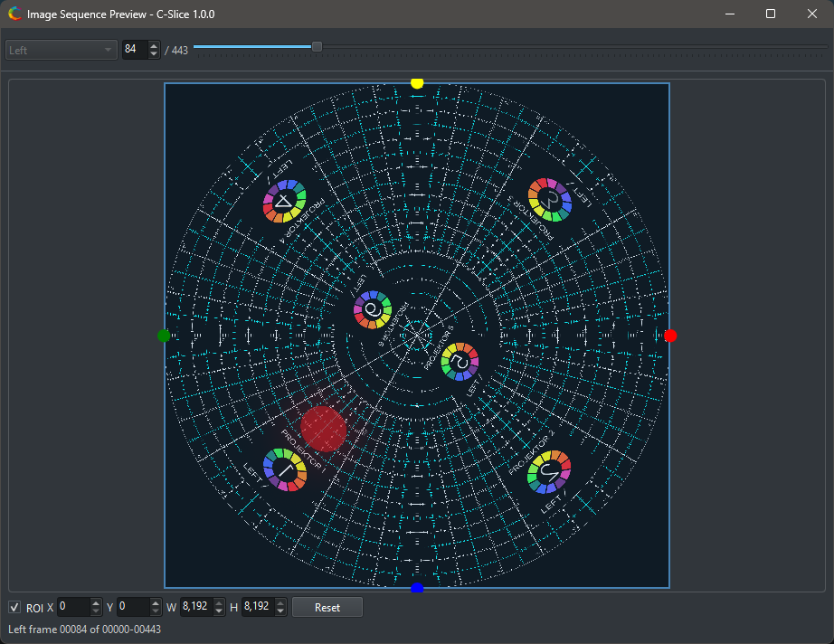

# Verify and preview

C-Slice provides tools to inspect source media and catch problems before a long render.

## Verify (image sequence input)

**Verify** checks all selected left and right input images in the current frame range. It verifies that files can be decoded and that image dimensions match the expected sequence. This applies to image sequence input only; video input uses **Read metadata** instead.

Use it when:

- A sequence was copied from another machine.
- A render range is large.
- Stereo sources may be mismatched.
- You changed image error behavior.

If verification fails, C-Slice lists failed files in the Progress panel. Click a failed file to open it with the system default handler.

## Image Sequence Preview

**Image Sequence Preview** opens a separate preview window for the selected left or right sequence. Use it to inspect frame selection, source orientation, and region of interest.

The preview window can help set normalized ROI values before rendering. ROI values are stored as fractions of image width and height, from `0.0` to `1.0`.

## Video Preview (video input)

When **Input type** is set to *Video*, the toolbar button changes to **Video Preview**. It opens a preview window that plays back the selected video file using MPV. Use it to confirm the correct file is loaded and that the expected content is visible before starting a render.

## Image error behavior (image sequence input)

The **Advanced > Image errors** setting controls what happens when a source frame cannot be read during rendering. This setting is only active when **Input type** is *Image sequence*:

- **Abort on image error** stops the job.
- **Pause on image error** pauses so the problem can be inspected.
- **Continue on image error** continues the job and records the failure.

For final production renders, use **Verify** first even if the job is configured to continue on image errors.