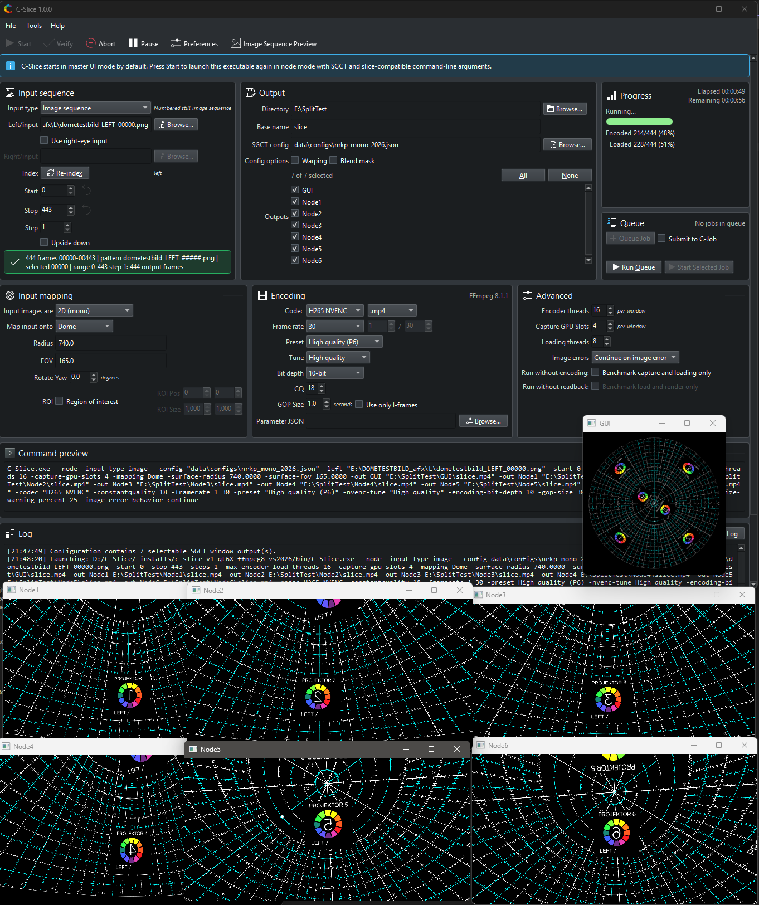

# C-Slice : Media Slicer for Immersive Environments

C-Slice is an open source media encoder for preparing image sequences and video files for immersive playback systems. It renders dome, spherical, fisheye, planar, and SGCT-window based outputs, then encodes each selected output window with FFmpeg.

C-Slice is designed to complement playback tools such as [C-Play](https://github.com/c-toolbox/C-Play): C-Play runs media in an immersive environment, while C-Slice prepares per-window video or image outputs that match the SGCT configuration used by that environment.

## How C-Slice works

C-Slice starts as a Qt/Kirigami master UI. When you press **Start**, the UI launches the same executable again in node mode with SGCT and slice-compatible command-line arguments. The node process loads the selected source media (image sequence or video file), maps it onto the chosen surface, renders each selected SGCT window, captures the result, and sends the frames to FFmpeg encoders.

The workflow is intentionally file based:

- Input comes from numbered still image sequences or video files.
- Output targets come from SGCT JSON configuration windows.
- Encoding comes from UI settings and optional FFmpeg parameter JSON files.
- Production defaults are saved in the C-Slice preferences.

## Guides

1. [Install C-Slice](install.md)
2. [Setup C-Slice](setup.md)
3. [Media and data structure](media.md)
4. [Slice workflow](workflow.md)
5. [Settings](settings.md)
6. [Build from code](build.md)
7. [Versions](versions.md)

## Main features

- Slice mono or stereo image sequences or video files into SGCT window outputs.
- Map content onto dome, equirectangular sphere, equiangular cubemap sphere, or plane geometry.
- Use SGCT configuration files to select the exact windows to render.
- Encode video with FFmpeg using H.264, H.265, NVENC, ProRes, Hap, VP8, VP9, MPEG, or still-image output codecs.
- Preview source media and verify image sequences before running a long slice job.
- Use benchmark modes for loading, rendering, capture, and encoding performance tests.
- Mux mono audio channel files into a multi-channel WAV file.

## Backend

C-Slice is based on these open source projects:

- [SGCT](https://sgct.github.io/) - Simple Graphics Cluster Toolkit, used for window, viewport, projection, and capture setup.
- [FFmpeg](https://ffmpeg.org/) - Used for video and image encoding, and for audio muxing.
- [Qt](https://www.qt.io/) and [KDE Frameworks](https://develop.kde.org/products/frameworks/) - Used for the master UI.
- [Wuffs](https://github.com/google/wuffs) - Used for high-performance image loading in current builds.

# License

C-Slice is licensed under the [GNU General Public License v3.0](https://choosealicense.com/licenses/gpl-3.0/).

# Contact

For questions or further information about the C-Slice project, contact [erik.sunden@liu.se](mailto:erik.sunden@liu.se).